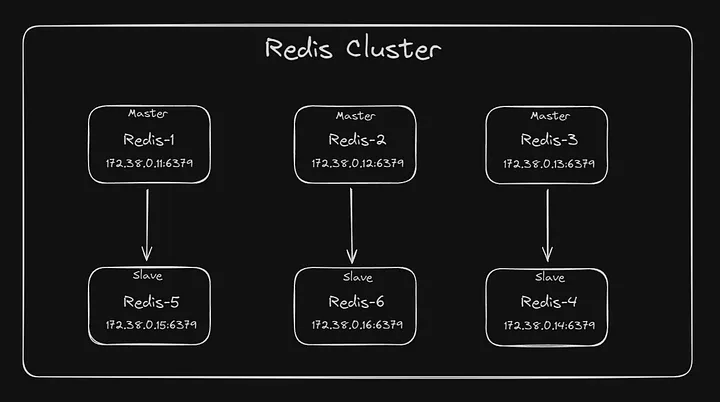

# create config volume 
bash setup-volume-config.sh

# run docker-compose
docker-compose up -d

# enter redis 1
docker exec -it redis-cluster_redis-1_1 bash

# create cluster
redis-cli --cluster create 172.38.0.11:6379 172.38.0.12:6379 172.38.0.13:6379 172.38.0.14:6379 172.38.0.15:6379 172.38.0.16:6379 --cluster-replicas 1

# enter redis-cli cluster
redis-cli -c

# get nodes info
cluster nodes